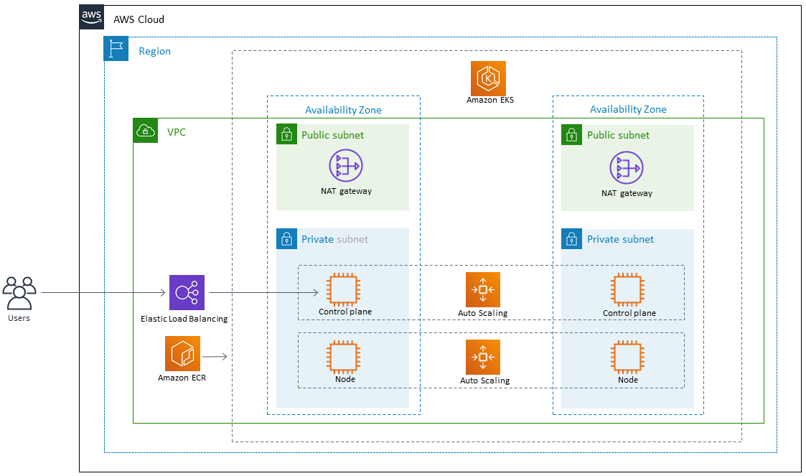

# Deploy simple-java-app on AWS EKS

## The following diagram shows an architecture for containerizing a Java microservice on Amazon EKS.

> 

-------------------------------------------------------------------------------------------------------------------------------------------------------

### Built With

- [Circle CI](www.circleci.com) - Cloud-based CI/CD service
- [Amazon AWS](https://aws.amazon.com/) - Cloud services
- [AWS CLI](https://aws.amazon.com/cli/) - Command-line tool for AWS
- [CloudFormation](https://aws.amazon.com/cloudformation/) - Infrastrcuture as code
- [Kubernetes](https://kubernetes.io/) - Container orchestration engine
